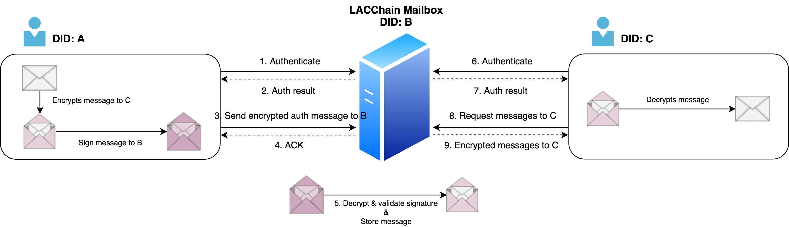
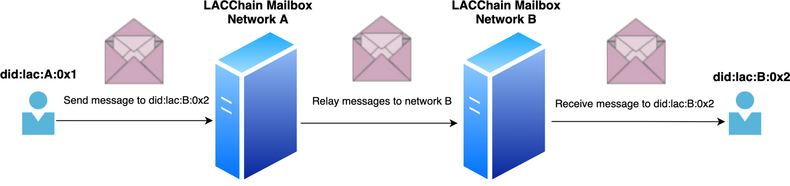

The LACChain Mailbox is a secure and private system for the exchange of messages, VCs, and VPs based on the [DIDComm Messaging Specification](https://identity.foundation/didcomm-messaging/spec/). It is a controlled by a centralized server that allows entities identified by a DID to send and receive messages.

## Operation Modes

According to the DIDComm Specification, there are two operation modes for an intermediary.

### As a Mediator

In this operation mode, the Mailbox provides a REST API that can be accessed by any application using the [DIDConnect Authentication Protocol](https://dev.lacchain.net/en/working-groups/ssi/authentication).



To send a message using the Mailbox as a Mediator, the subject A must encrypt the message to C and then wrap again into an encrypted envelope to B (Mailbox). 
Once the Mailbox receive the message it will unwrap the envelope and just storage the message encrypted to C.

### As a Relay

It is also possible to use the Mailbox as a Relay to route messages through different networks or transport protocols.



In this operation mode the Mailbox will only act as a proxy to relay the message to another Mailbox. 
The message only needs to be encrypted for the recipient, and the mailbox does not unwrap or modify the message in any way.

## Message Envelope

Currently, the Mailbox only support authenticated encryption, thus in order to guarantee the integrity and privacy of the message.

The envelope to wrap for Mailbox Mediator is as follows:

```json
{
    "type": "https://didcomm.org/routing/2.0/forward",
    "to": [MAILBOX_DID],
    "expires_time": EXPIRATION_TIME_MILIS,
    "body":{
        "next": RECEIVER_DID,
        "payloads~attach": [
            MESSAGE_ENCRYPTED
        ]
    }
}
```

## DID Service

To resolve the endpoint of Mailbox in a DID document, every sender / receiver must include a Service for messaging purpose.

```json
"service": [{
        "type": "DIDComm",
        "endpoint": "MAILBOX_DID"
}]
```

When an instance of Mailbox is deployed, it is necessary to specify a DID associated to the Mailbox, and register a DID Service with the url of API as the endpoint.

```json
"service": [{
        "type": "DIDComm",
        "endpoint": "API_URL"
}]
```

### LACChain Endpoint

The official mailbox from lacchain has the following DID: 

**MAILBOX_DID:** ```did:lac:main:0x5c3968542ca976bec977270d3fe980dd4742865e```

And, it can be resolved in the following DID Registry: ``0xCC77A5e709cB473F49c943D9b40B989f986E5F2F``

## API

### 1. Send a Message

1. Resolve the DID Document of the recipient
2. Get the DIDComm service endpoint
3. Resolve the DID Document of the DIDComm service endpoint
4. Encrypt the message for the recipient using [Authenticated Encryption](https://datatracker.ietf.org/doc/html/draft-madden-jose-ecdh-1pu-04) 
5. Encrypt the message for Mailbox wrapping the previous message in the envelope described above and using [Authenticated Encryption](https://datatracker.ietf.org/doc/html/draft-madden-jose-ecdh-1pu-04)
6. Generate the ``id_token`` using the [DIDConnect Protocol](https://dev.lacchain.net/en/working-groups/ssi/authentication)
7. Send the request to Mailbox API:
```bash
POST /vc
Headers:
Content-Type: 'application/json'
token: id_token
Body:
<<Encrypted Message for Mailbox>>
```

The possible responses for that request are:

1. 200 - The message was successfully received 
2. 500 - Authentication error

### 2. Receive Messages

1. Generate the ``id_token`` using the [DIDConnect Protocol](https://dev.lacchain.net/en/working-groups/ssi/authentication)
2. Send the request to Mailbox API:
```bash
GET /vc
Headers:
Content-Type: 'application/json'
token: id_token
```

The possible responses for that request are:

1. 200 - An array of messages
2. 500 - Authentication error

## Pre requisites

- Node > v14.4
- Redis

## Testing

```bash
npm install
npm test
```

## Deploy

```bash
npm install
npm start
```

## Licence

Copyright 2021 LACChain

Licensed under the Apache License, Version 2.0 (the "License"); you may not use this file except in compliance with the License. You may obtain a copy of the License at

http://www.apache.org/licenses/LICENSE-2.0

Unless required by applicable law or agreed to in writing, software distributed under the License is distributed on an "AS IS" BASIS, WITHOUT WARRANTIES OR CONDITIONS OF ANY KIND, either express or implied. See the License for the specific language governing permissions and limitations under the License.
